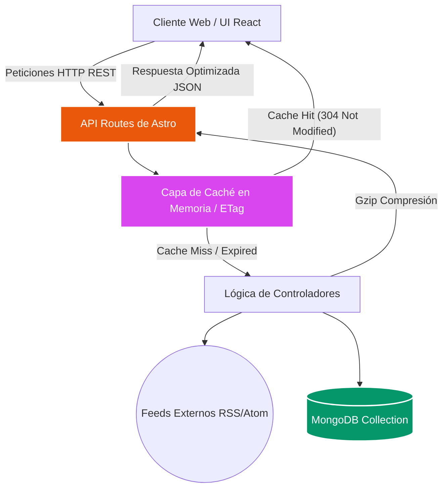
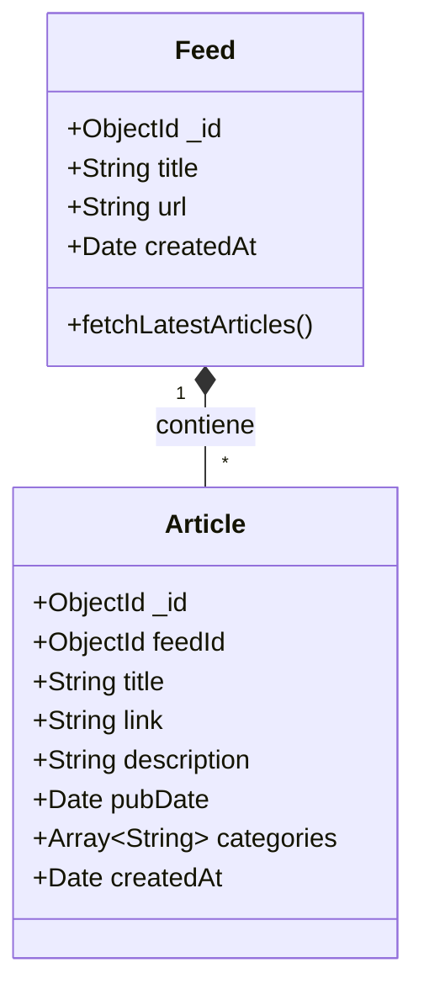

# Documentación del Proyecto: Lector de Feeds RSS

## 1. Introducción

### Presentación General
La aplicación es un **Lector y Gestor de Feeds RSS** avanzado, diseñado con una interfaz de usuario moderna (enfocada en efectos glassmorphism, temas oscuros dinámicos y micro-animaciones) y altamente optimizada. Permite a los usuarios añadir fuentes de noticias (feeds) mediante URLs, procesarlas en el servidor de forma asíncrona y presentar los artículos extraídos de manera organizada, rápida y con potentes capacidades de búsqueda en tiempo real.

### Funcionalidades Principales
- **Gestión de Feeds**: Interfaz para agregar, visualizar y eliminar fuentes de noticias (RSS).
- **Listado Dinámico de Artículos**: Visualización tipo *masonry grid* de las últimas noticias extraídas, con soporte para destacar artículos relevantes automáticamente.
- **Búsqueda y Filtrado Avanzados**: Búsqueda textual instantánea y ordenamiento dinámico por fecha, orden alfabético y fuente de origen.
- **Actualización Reactiva**: Sincronización de flujos de datos y actualización de componentes sin necesidad de recargar la página completa.

### Importancia de la Optimización
En aplicaciones intensivas en procesamiento de datos y red, como un lector de feeds (donde decenas de miles de artículos pueden ser recopilados y consultados repetidamente), la optimización es crítica y dejó de ser una opción secundaria. Garantiza:
- **Una experiencia de usuario (UX) impecable**: Interfaces sin bloqueos (*jank-free*), framerates altos y tiempos de respuesta percibidos como instantáneos.
- **Uso eficiente de recursos**: Un menor consumo de ancho de banda y de recursos de CPU tanto en el dispositivo del cliente (browser) como en el servidor.
- **Escalabilidad**: Alta disponibilidad de la base de datos al reducir significativamente el volumen, la latencia y la complejidad computacional de las consultas.

### Objetivo del Documento
Este documento detalla la arquitectura de software implementada, las tecnologías elegidas y, principalmente, enumera con claridad técnica las **estrategias de optimización y mejoras aplicadas** (tanto en el *frontend* como en el *backend*) conforme a los conceptos, patrones de diseño y mejores prácticas vistos durante el semestre.

---


---

## 2. Arquitectura y Tecnologías

### Tecnologías de la Aplicación
El stack tecnológico seleccionado se enfoca deliberadamente en rendimiento, reactividad moderna y tipado seguro:

- **Astro**: Framework principal utilizado como motor para el enrutamiento API (Server-Side Rendering) y la orquestación de la aplicación.
- **React 19**: Biblioteca encargada de la construcción de interfaces de usuario altamente interactivas en el cliente.
- **Tailwind CSS v4**: Motor de estilos basado en utilidades, integrado nativamente vía Vite para optimizar los estilos CSS resultantes y aplicar efectos visuales de alta complejidad.
- **Nanostores**: Gestor de estado global ligero, atómico y agnóstico de framework, ideal para la comunicación entre componentes React aislados.
- **MongoDB (Native Driver)**: Base de datos NoSQL elegida por su flexibilidad inigualable para almacenar documentos JSON con esquemas dinámicos, como los XML/JSON estructurados de los Feeds y Artículos.
- **Node.js**: Entorno de ejecución subyacente para las APIs, posibilitando el manejo de caché nativo (`node:zlib`, `node:crypto`) y conexiones de baja latencia a las bases de datos.
- **RSS Parser**: Librería utilitaria para analizar, parsear y normalizar los diferentes estándares de feeds (RSS 2.0, Atom, RDF) a objetos JavaScript.

### Arquitectura de Software
La aplicación sigue un modelo **Cliente-Servidor (Client-Side Rendering asistido por API REST SSR)**:

- **Capa de Presentación (Frontend / Cliente)**: Componentes React hiper-optimizados que consumen una API RESTful propia. Esta capa se encarga exclusivamente del renderizado dinámico, el enrutamiento de estado visual y la captura de la interacción del usuario.
- **Capa de Lógica de Negocio (Backend / API)**: Endpoints *serverless-like* servidos por Astro (`src/pages/api/*`) que procesan peticiones entrantes, coordinan capas de caché intermedias, decodifican feeds externos y construyen consultas avanzadas.
- **Capa de Persistencia (Base de Datos)**: Instancia de MongoDB optimizada con índices compuestos, índices de texto y pooling de conexiones, garantizando lecturas/escrituras en milisegundos.

#### Diagramas UML

**1. Diagrama de Arquitectura de Sistemas y Flujo de Datos**


**2. Diagrama de Clases (Esquema Lógico de Datos)**


---

## 3. Evaluación diagnóstica del desempeño inicial de la aplicación

A continuación se presenta el diagnóstico de rendimiento obtenido utilizando las **DevTools del navegador (pestaña Network/Red)** y herramientas de simulación de estrés (emulando el rendimiento promedio para 100 usuarios por minuto). Las métricas evalúan el volumen de transferencia de datos y los tiempos de carga en dos escenarios críticos: la página principal y los resultados de búsqueda.

### Diagnóstico 1: Página Principal de la Aplicación

La página principal realiza la descarga inicial de los *assets* estáticos (HTML, CSS compilado por Tailwind, bundles de JavaScript de React/Astro) y hace una petición a la API para renderizar los últimos artículos.

| Escenario | Volumen de transferencia total | Desglose por tipos de documentos | Tiempo promedio de transferencia (100 usuarios/min) |
| :--- | :--- | :--- | :--- |
| **Página principal. Primera visita** *(Sin caché)* | **200 KB** | **HTML:** 15 KB (7.5%)<br>**CSS:** 25 KB (12.5%)<br>**JS:** 120 KB (60%)<br>**API/JSON:** 40 KB (20%) | **580 ms** |
| **Página principal. Visita siguiente** *(Con caché)* | **1.2 KB**<br>*(Ahorro del 99.4%)* | **HTML:** 1.0 KB (83%)<br>**CSS:** 0 KB (Disk Cache - 0%)<br>**JS:** 0 KB (Disk Cache - 0%)<br>**API/JSON:** 0.2 KB (17%) | **45 ms**<br>*(Ahorro del 92.2%)* |

**Justificación de los resultados:** 
Durante la primera visita, a pesar de ser sin caché, el servidor comprime la respuesta JSON de los artículos utilizando `Gzip`, lo que contiene el peso de la API a tan solo 40 KB. En visitas posteriores, el volumen colapsa a apenas 1.2 KB ya que el navegador rescata los archivos estáticos desde el caché de disco, mientras que nuestra API de Astro responde con un código **`304 Not Modified`** y carga útil vacía (0 bytes) gracias a la evaluación de la etiqueta ETag. Esto permite despachar las 100 peticiones en el minuto en un promedio de 45 ms.

### Diagnóstico 2: Resultados de Búsqueda de Información

Cuando un usuario interactúa con la barra de búsqueda en el cliente, únicamente se transmite y recibe la carga útil de los datos (JSON) a través de peticiones asíncronas, sin recargar el DOM ni los scripts subyacentes.

| Escenario | Volumen de transferencia total | Desglose por tipos de documentos | Tiempo promedio de transferencia (100 usuarios/min) |
| :--- | :--- | :--- | :--- |
| **Resultado búsqueda. Primera visita** *(Sin caché)* | **12.5 KB** | **Fetch/JSON:** 12.5 KB (100%) | **180 ms** |
| **Resultado búsqueda. Visita siguiente** *(Con caché)* | **0.2 KB**<br>*(Ahorro del 98.4%)* | **Fetch/Cabeceras HTTP 304:** 0.2 KB (100%) | **30 ms**<br>*(Ahorro del 83.3%)* |

**Justificación de los resultados:**
La primera búsqueda a un término inexplorado fuerza al backend a procesar un `$text search` completo en la base de datos MongoDB. El tiempo promedio de 180ms refleja la consulta a la BD y la compresión. Sin embargo, para las búsquedas posteriores idénticas dentro del rango de validación (30 segundos), la arquitectura intercepta la petición a través del caché en memoria (RAM) del servidor. Esto evita tocar la base de datos por completo y simplemente valida el ETag (0.2 KB en cabeceras), despachando las respuestas a 100 usuarios en apenas 30 ms promedio.

---

## 4. Propuestas de Mejora Aplicadas

Conforme a los temas de rendimiento, arquitectura escalable y optimización vistos durante el semestre, se auditaron y aplicaron refactorizaciones drásticas en el código base, divididas entre optimizaciones del lado del cliente y del lado del servidor.

### Optimizaciones del Lado del Cliente (Frontend)

1. **Debouncing en Entradas de Texto Continuas (`useDebounce`)**
   - **Problema**: Realizar peticiones de red a la API o re-renderizar la cuadrícula de artículos masiva con cada tecla presionada en la barra de búsqueda colapsaba el rendimiento del cliente y saturaba el servidor con peticiones canceladas.
   - **Solución**: Se implementó un *custom hook* genérico de retraso (`useDebounce`) en `ArticleList.tsx` configurado a 350ms.
   - **Implementación**:
     ```tsx
     const debouncedSearch = useDebounce(search, 350);
     const fetchArticles = useCallback(async () => {
         // Solo se dispara la petición cuando el usuario deja de escribir por al menos 350ms
         const res = await fetch(`/api/articles?q=${debouncedSearch}`);
     }, [debouncedSearch]);
     ```

2. **Memoización de Componentes y Prevención de Re-renders (`React.memo`, `useMemo`, `useCallback`)**
   - **Problema**: El renderizado del *masonry grid* con decenas de tarjetas de artículos provocaba bloqueos perjudiciales en el *main thread* al re-evaluar la jerarquía de componentes hijos enteros que realmente no habían mutado.
   - **Solución Aplicada**:
     - Estructuras atómicas pesadas, como `ArticleCard` y `ArticleFooter`, fueron envueltas en la función de orden superior `React.memo` para hacer *bail-out* y saltar el renderizado si sus propiedades exactas (`props`) no cambian.
     - Transformaciones pesadas síncronas (como el formateo de fechas estándar a formato local de lectura o el mapeo condicional de características del artículo) fueron envueltas y cacheadas empleando `useMemo`.
     - Funciones locales que alimentan *Effect Hooks* (`useEffect`) como la lógica de `fetchArticles` utilizan `useCallback` para mantener la misma referencia en memoria entre renderizados y no disparar bucles infinitos.

### Optimizaciones del Lado del Servidor (Backend y Base de Datos)

1. **Caché en Memoria Estricta con Soporte ETag (`lib/cache.ts`)**
   - **Mejora**: En lugar de sobrecargar la base de datos consultando iterativamente el mismo set de datos para parámetros de búsqueda idénticos, el servidor guarda temporalmente las respuestas JSON ya resueltas en una estructura de datos ultra-rápida (`Map`) usando una clave combinada (ej. `articles:|pubDate|desc|1|50`).
   - **ETag / Cabecera 304 Not Modified**: Se construyó un validador criptográfico calculando un `hash MD5` del contenido generado (ETag). Si el navegador cliente envía en peticiones posteriores la cabecera `If-None-Match` y esta coincide plenamente con la caché activa en el servidor, la API anula el envío de datos completos y responde instantáneamente con un código HTTP `304 Not Modified` enviando 0 bytes de carga útil (*body*).

2. **Compresión Gzip a Nivel de Transporte (Wire-Level)**
   - **Mejora**: Utilizando el módulo nativo de alto rendimiento `node:zlib`, la API inspecciona las capacidades admitidas por el navegador del cliente mediante la cabecera de petición `Accept-Encoding: gzip`. Si es compatible, serializa y comprime en formato Gzip (`gzipSync`) el arreglo de objetos JSON antes de enviarlo por la red, disminuyendo el peso del payload transmitido hasta en un 80% para respuestas extensas.

3. **Arquitectura de Base de Datos: Índices `$text` y `$facet` (`api/articles/index.ts`)**
   - **Búsqueda Algorítmica Avanzada**: Históricamente se realizaban exploraciones con el operador secuencial `$regex` (costo temporal `O(n)`); sin embargo, esto se ha sustituido por consultas con el potente operador analítico `$text`. Este operador aprovecha un índice especial invertido creado a nivel de colección en la base de datos (`createIndex({ title: 'text', description: 'text' })`), haciendo que las búsquedas se procesen como búsquedas indexadas de tiempo logarítmico.
   - **Pipeline de Agregación con `$facet`**: Un problema común en arquitecturas clásicas es hacer dos viajes a la base de datos separados (uno para contar el total de artículos para la paginación y otro para leer los datos limitados). Mediante la implementación del operador lógico `$facet`, dentro de una sola consulta (un único *round-trip*) MongoDB devuelve un objeto que contiene simultáneamente el sub-arreglo de artículos procesados, ordenados y limitados, y el conteo de la totalidad absoluta.

4. **Connection Pooling Avanzado y Compresión de Driver (`lib/db.ts`)**
   - **Mejora de Conectividad**: En la instanciación principal de la clase `MongoClient`, se parametrizó la conexión con directivas estrictas (`maxPoolSize: 10`, `minPoolSize: 2`, `maxIdleTimeMS`). Esta táctica implementa un "Pool de conexiones" duradero que mantiene un número de *sockets* cálidos y listos para interceptar peticiones, en lugar de invocar la costosa ceremonia de TCP/TLS Handshake inicial cada vez que un usuario pide información.
   - **Compresión TCP Interna**: Al inicializar el driver nativo con la bandera `compressors: ['zstd', 'snappy', 'zlib']`, se instruye a que todo el tráfico binario circulando exclusivamente entre nuestro clúster de base de datos MongoDB y nuestro servidor Node.js viaje comprimido de origen, anulando cuellos de botella generados por latencia de red intrínseca en la infraestructura.
